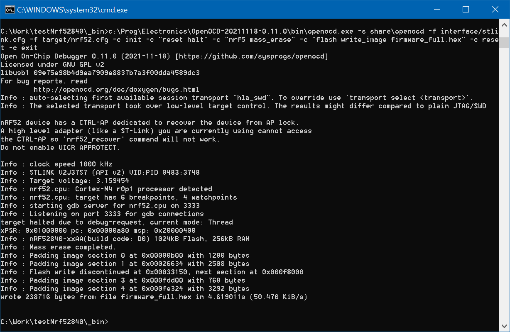
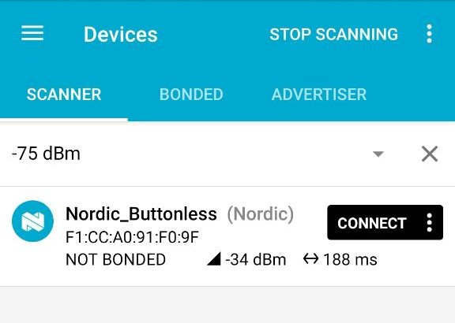
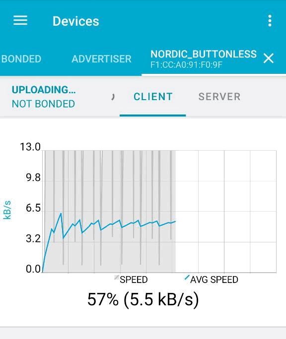
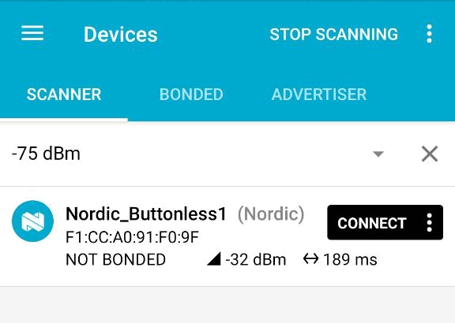

# nRF52840 - минимальный проект с buttonless_dfu и программатором ST-LINK_V2

Был закуплен Bluetooth-модуль nRF52840 для поделок, программатор ST-LINK_V2 уже имелся

Задача прошить nRF52840 так, чтобы потом можно было обновлять без программатора "по воздуху" (т.е. OTA = Over-The-Air) через android-приложение nrfConnect

## Hardware

- ST-LINK_V2
- модуль nRF52840 ( брал https://aliexpress.ru/item/4000549400204.html по 650 рублей). Припаял [VDD+VDDH, GND, SWD, SCK] - подключено к ST-LINK_V2, [ P0.24 ] подключил к UART-USB переходнику для отладки

## Software ( под Windows )

- nRF-Command-Line-Tools (для mergehex.exe) ( https://www.nordicsemi.com/Products/Development-tools/nrf-command-line-tools/download )
- nrfutil.exe - для Bootloader ( https://github.com/NordicSemiconductor/pc-nrfutil/releases/ )
- nRF5_SDK_17.1.0_ddde560 ( https://www.nordicsemi.com/Products/nRF52840 )
- GNU Arm Embedded Toolchain 10 2021.10 (для Keil не нужен - разве что обновить в компнентах)
- make (взял из состава Qt/mingw32 ) (для Keil не нужен)
- OpenOCD - прошивать через ST-LINK_V2 ( https://github.com/openocd-org/openocd/releases )

В качестве IDE взял MS VSCode, тут каждый выбирает по вкусу

## Программа

Рабочая прошивка состоит из 3 частей:

- softdevice - `nRF5_SDK_17.1.0_ddde560\components\softdevice\s140\hex` 
- bootloader - загрузчик
- application - рабочая программа

Softdevice + bootloader записываются один раз (обычно), а рабочую программу можно обновлять по воздуху.

### bootloader - загрузчик

**(1)** Прошивки-по-воздуху подписываются файл-ключом. Ключ-файл генерируется командой `nrfutil keys generate private.key`.  
Также следует генерировать ключ для загрузчика `nrfutil keys display --key pk --format code private.key --out_file dfu_public_key.c` и скопировать его в проект загрузчика.  
Для удобства добавил `gen_key_file.bat` в папке **nrfUtil**

**(2)** Для того, чтобы загрузчик скомпилировался, надо сгенерировать вспомогательные файлы в папке `nRF5_SDK_17.1.0_ddde560\external\micro-ecc\` 

Для выполенения ***build_all.bat*** необходимо выполнить:
- если `make` не добавлено в Path операционной системы, в файле ***build_all.bat*** заменить `make` на полный путь, в моем случае `c:\Qt\Tools\mingw810_64\bin\mingw32-make.exe`
- отредактировать `nRF5_SDK_17.1.0_ddde560\components\toolchain\gcc\Makefile.windows` - указать правильный путь ( в моём случае *c:/Program Files (x86)/GNU Arm Embedded Toolchain/10 2021.10/bin/* обрати внимание на направление косой черты ), версию ( 10.3.1 )

Если выполнится успешно, то сгенерируются выходные файлы, например, ***micro-ecc\nrf52nf_armgcc\armgcc\micro_ecc_lib_nrf52.a***

**(3)** Берется проект из примеров ( nRF5_SDK_17.1.0_ddde560\examples\dfu\secure_bootloader\pca10056_s140_ble\ ). В ***makefile*** выполняются замены:
- SDK_ROOT (в моем случае `nRF5_SDK_17.1.0_ddde560` )
- выбирается нужная версия softdevice
- BOARD_PCA10056 на BOARD_CUSTOM - у меня не демоплата
- исправить пути к main.c, dfu_public_key.c, sdk_config.h и т.п.

Т.к. на модуле нет никаких кнопок/светодиодов/дисплеев, то в загрузчик никакой логики не добавляется, но надо выполнить следующее:
- в ***sdk_config.c*** надо изменить параметр `NRF_BL_DFU_ENTER_METHOD_BUTTON` на 0 и `NRF_BL_DFU_ENTER_METHOD_BUTTONLESS` на 1 - так как вход в загрузчик без всяких кнопок. Можно воспользоваться утилитой nRF5_SDK_17.1.0_ddde560\external_tools\cmsisconfig\CMSIS_Configuration_Wizard.jar
- убрать в ***main.c*** вызовы функций GPIO

### application - рабочая программа

Беру проект из примеров `ble_app_template`. В ***makefile*** выполняю замены аналогично bootloader + отладочный выход на UART ножку P0.26

## Процесс прошивки

После компиляции загрузчика и основного приложения получаем 2 файла в папка _build: ***bootloader.hex*** и ***app.hex***

### Сборка файлов
Для первоначальной прошивки устройства можно вручную записать три файла, либо из всех файлов сделать единый hex-файл. Этот файл также должен включать ***bootloader_setting.hex*** который генерируется отдельно с помощью `nrfutil`:  

```
nrfutil settings generate --family NRF52840 --application ..\application\_build\app.hex --application-version 0 --bootloader-version 0 --bl-settings-version 2 bootloader_setting.hex --app-boot-validation NO_VALIDATION --softdevice %SOFT_DEVICE% --key-file private.key
```
Параметры вызова:
- версии приложения и загрузчика 0
- версия настроек 2
- %SOFT_DEVICE% предварительно объявленная переменная с путём до нужного softdevice.hex

Для сборки в единый hex-файл следует использовать утилиту `mergehex.exe`:
```
"c:\Program Files\Nordic Semiconductor\nrf-command-line-tools\bin\mergehex.exe" -m ..\bootloader\_build\bootloader.hex bootloader_setting.hex %SOFT_DEVICE% ..\application\_build\app.hex -o testNRF52840_full.hex
```

В итоге получится hex-файл testNRF52840_full.hex объёмом порядка 650 кБайт.  

Для удобства генерации были написаны 2 bat-файла: ***gen_firmware_dfu.bat*** и ***gen_firmware_full.bat***

### Прошивка через stlink_v2

В некоторых инструкциях различаются команды: могут быть "reset init", могут быть отдельно "-c halt", но в моём случае работает следующий вызов ***openOCD_flash.bat***:
```
c:\Prog\Electronics\OpenOCD-20211118-0.11.0\bin\openocd.exe -s share\openocd -f interface/stlink.cfg -f target/nrf52.cfg -c init -c "reset halt" -c "nrf5 mass_erase" -c "flash write_image firmware_full.hex" -c reset -c exit
```
Время записи около 5 секунд.



## Обновление через телефон

Для обновления прошивки через приложение `NRFConnect` (в google-play-store и apple-app-store) для телефона надо собрать архив с подписью и особым файлом, в котором указывается тип процессора и версия SoftDevice. Утилиту `nrfutil` следует запускать с параметрами:  
` nrfutil pkg generate --hw-version 52 --sd-req 0x00 --application-version 1 --key-file private.key --application ..\application\_build\app.hex  firmware.zip`
- hw-version - равно значению NRF_DFU_HW_VERSION в bootloader sdk_config.h
- sd-req - разный для различных SoftDevice, 0xCA=S140 v7.0.1, 0xCB=S132 v7.0.1, **но можно указать 0x00**
- application-version - должен с каждым разом увеличиваться? (работает и с константной 1)
- key-file - указывается файл с ключом

В прошивке меняю DEVICE_NAME на "Nordic_Buttonless1" для проверки, генерирую архив ***firmware.zip*** и посылаю через телефон.

Было | Обновление | Стало
:-:|:-:|:-:
 |  | 

Процесс обновления иногда "висит" на 0%. В моём случае это была проблема приложения на телефоне - закрыл приложение, завершил все задачи в фоне и тогда заработало.

